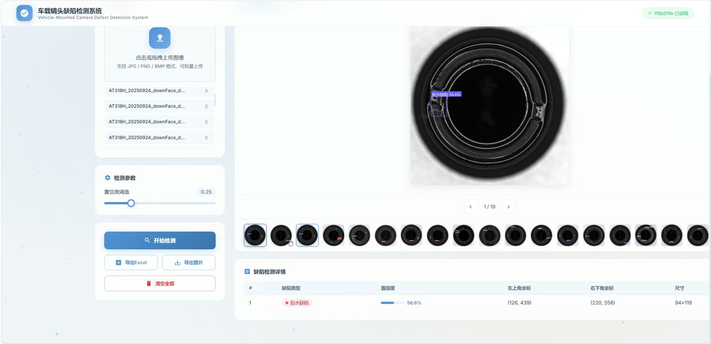
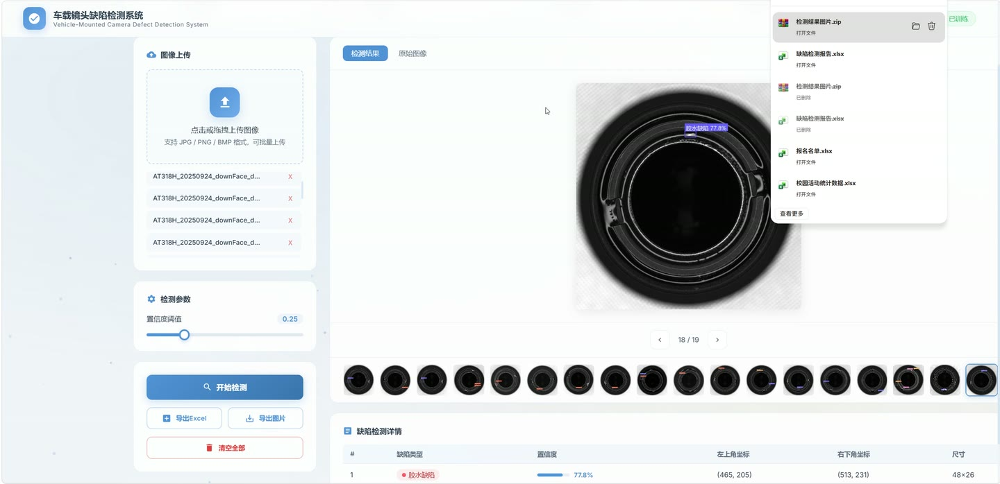
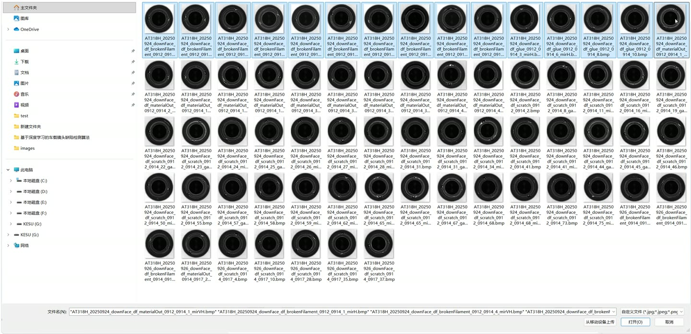
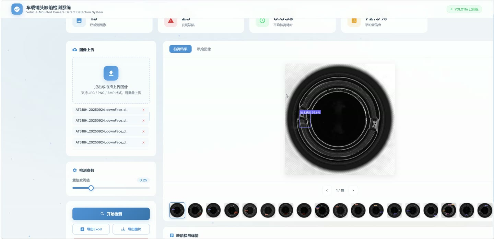
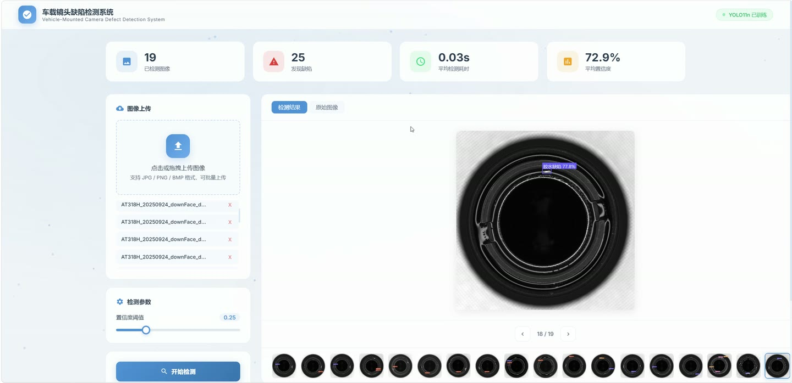
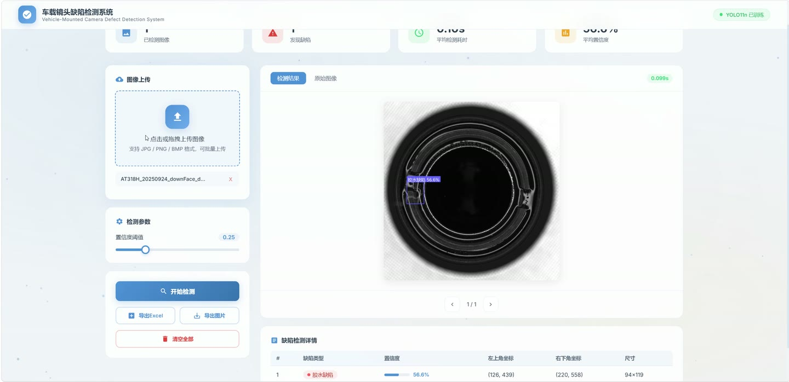

# (附文档)Python+YOLO+深度学习 基于深度学习的车载镜头缺陷检测算法

**技术栈**：Python、Flask、PyTorch、YOLO、深度学习

### 系统简介

本系统是一套基于深度学习 YOLO11n 的车载镜头缺陷检测 Web 应用，采用 Flask 后端与前端页面相结合的方式构建，通过加载训练好的 YOLO11n 权重对上传的车载镜头图像进行缺陷识别，自动标注缺陷位置与类别，并支持检测结果的可视化展示与报告导出。系统包含普通用户端与管理员端两类使用角色。
 
### 核心功能
 
### 普通用户端

- 访问首页检测界面，浏览系统提供的图像上传与检测操作入口。

- 上传单张或多张车载镜头图像进行检测，支持 jpg、jpeg、png、bmp、tiff、tif 等格式，单次上传总大小不超过 200MB。

- 通过滑块或输入框调整置信度阈值（默认 0.25），控制检测结果的灵敏度。

- 批量提交多张图像，系统逐张执行检测并返回每张图像的独立结果。

- 查看检测结果图像，缺陷区域以彩色矩形框标注，并叠加中文类别名称与置信度百分比。

- 查看每张图像的缺陷数量统计与检测耗时（秒）。

- 查看每个缺陷的详细信息，包括缺陷类别（中文与英文）、置信度、边界框坐标、中心点坐标与缺陷尺寸。

- 识别五类缺陷：材料缺失、间隙缺陷、胶水缺陷、断丝缺陷、铜丝缺陷。

- 导出 Excel 检测报告，报告包含序号、图像文件名、缺陷类型、置信度、边界框坐标等字段，并附生成时间与汇总统计。

- 导出标注后的检测结果图像，系统将所有结果图打包为 ZIP 压缩包供下载。

- 查看系统模型信息，包括模型类型、缺陷类别列表、类别数量、输入尺寸与模型状态。
 
### 管理员端

- 准备数据集，读取 ImageSets 目录下的 train.txt、val.txt 划分文件，自动将图像与标签复制到 train、val、test 子目录。

- 当缺少划分文件时，按 8:1:1 比例自动随机划分训练集、验证集与测试集。

- 自动生成并更新 data.yaml 配置文件，写入数据集路径、训练/验证/测试目录与五类缺陷名称映射。

- 执行第一轮基础训练，使用 yolo11n.pt 预训练权重，设置 100 轮次、imgsz 640、batch 8、SGD 优化器、lr0 0.01 等参数。

- 配置数据增强策略，包括 HSV 色调/饱和度/亮度调整、随机旋转 15 度、平移、缩放、水平翻转、垂直翻转、Mosaic 与 MixUp 增强。

- 执行第二轮精细调优，基于第一轮最佳权重继续训练 50 轮次，降低学习率至 0.001，减弱数据增强强度，启用余弦退火学习率调度。

- 在测试集上评估模型性能，输出 mAP@0.5、mAP@0.5:0.95、Precision、Recall 等指标。

- 将最终训练模型复制到项目根目录 best.pt，供检测系统加载使用。

- 配置训练过程的保存策略，包括 save_period 定期保存、patience 早停、plots 绘图与验证集评估。
 
### 技术栈

后端框架Flask
深度学习框架PyTorch、Ultralytics YOLO11
检测模型YOLO11n（Nano 轻量级版本）
图像处理OpenCV、Pillow（PIL）
数值计算NumPy
报告导出openpyxl、zipfile
前端页面Flask Jinja2 模板渲染
文件上传Werkzeug secure_filename
数据格式YOLO TXT 标注、YAML 数据集配置
 
### 交付内容

- 后端完整源码

- 前端完整源码

- 数据库初始化脚本

- 万字文档

## 界面展示

---

## 获取完整源码 + 万字文档

本仓库为项目介绍页。**完整前后端源码、数据库初始化脚本、万字项目文档**，请加微信 `kangkangcode`，或访问 [codekk.top](http://codekk.top) 获取。

可作课程设计 / 毕业设计参考，支持远程部署调试。